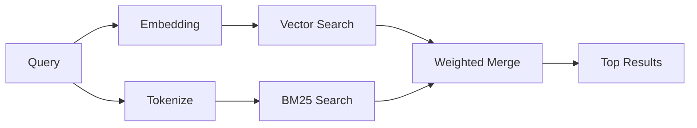

`memory_search` finds relevant notes from your memory files, even when the
wording differs from the original text. It works by indexing memory into small
chunks and searching them using embeddings, keywords, or both.

## Quick start

Memory search uses OpenAI embeddings by default. To use another embedding
backend, set a provider explicitly:

```json5
{
  agents: {
    defaults: {
      memorySearch: {
        provider: "openai", // or "gemini", "local", "ollama", "openai-compatible", etc.
      },
    },
  },
}
```

For multi-endpoint setups with memory-specific providers, `provider` can also
be a custom `models.providers.<id>` entry, such as `ollama-5080`, when that
provider sets `api: "ollama"` or another memory embedding adapter owner.

For local embeddings with no API key, install
`@openclaw/llama-cpp-provider` and set `provider: "local"`. Source checkouts
may still require native build approval: `pnpm approve-builds` then
`pnpm rebuild node-llama-cpp`.

Some OpenAI-compatible embedding endpoints require asymmetric labels such as
`input_type: "query"` for searches and `input_type: "document"` or `"passage"`
for indexed chunks. Configure those with `memorySearch.queryInputType` and
`memorySearch.documentInputType`; see the [Memory configuration reference](/reference/memory-config#provider-specific-config).

## Supported providers

| Provider          | ID                  | Needs API key | Notes                         |
| ----------------- | ------------------- | ------------- | ----------------------------- |
| Bedrock           | `bedrock`           | No            | Uses AWS credential chain     |
| DeepInfra         | `deepinfra`         | Yes           | Default: `BAAI/bge-m3`        |
| Gemini            | `gemini`            | Yes           | Supports image/audio indexing |
| GitHub Copilot    | `github-copilot`    | No            | Uses Copilot subscription     |
| Local             | `local`             | No            | GGUF model, ~0.6 GB download  |
| Mistral           | `mistral`           | Yes           |                               |
| Ollama            | `ollama`            | No            | Local/self-hosted             |
| OpenAI            | `openai`            | Yes           | Default                       |
| OpenAI-compatible | `openai-compatible` | Usually       | Generic `/v1/embeddings`      |
| Voyage            | `voyage`            | Yes           |                               |

## How search works

OpenClaw runs two retrieval paths in parallel and merges the results:



- **Vector search** finds notes with similar meaning ("gateway host" matches
  "the machine running OpenClaw").
- **BM25 keyword search** finds exact matches (IDs, error strings, config
  keys).

If only one path is available, the other runs alone. Intentional FTS-only mode
(`provider: "none"`) and automatic/default provider selection can still use
lexical ranking when embeddings are unavailable.

Explicit non-local embedding providers are different. If you set
`memorySearch.provider` to a concrete remote-backed provider and that provider
is unavailable at runtime, `memory_search` reports memory as unavailable instead
of silently using FTS-only results. This keeps a broken configured semantic
provider visible. Set `provider: "none"` for deliberate FTS-only recall, or fix
the provider/auth configuration to restore semantic ranking.

## Improving search quality

Two optional features help when you have a large note history:

### Temporal decay

Old notes gradually lose ranking weight so recent information surfaces first.
With the default half-life of 30 days, a note from last month scores at 50% of
its original weight. Evergreen files like `MEMORY.md` are never decayed.

<Tip>
Enable temporal decay if your agent has months of daily notes and stale
information keeps outranking recent context.
</Tip>

### MMR (diversity)

Reduces redundant results. If five notes all mention the same router config, MMR
ensures the top results cover different topics instead of repeating.

<Tip>
Enable MMR if `memory_search` keeps returning near-duplicate snippets from
different daily notes.
</Tip>

### Enable both

```json5
{
  agents: {
    defaults: {
      memorySearch: {
        query: {
          hybrid: {
            mmr: { enabled: true },
            temporalDecay: { enabled: true },
          },
        },
      },
    },
  },
}
```

## Multimodal memory

With Gemini Embedding 2, you can index images and audio files alongside
Markdown. Search queries remain text, but they match against visual and audio
content. See the [Memory configuration reference](/reference/memory-config) for
setup.

## Session memory search

You can optionally index session transcripts so `memory_search` can recall
earlier conversations. This is opt-in via
`memorySearch.experimental.sessionMemory`. See the
[configuration reference](/reference/memory-config) for details.

## Troubleshooting

**No results?** Run `openclaw memory status` to check the index. If empty, run
`openclaw memory index --force`.

**Only keyword matches?** Your embedding provider may not be configured. Check
`openclaw memory status --deep`.

**Local embeddings time out?** `ollama`, `lmstudio`, and `local` use a longer
inline batch timeout by default. If the host is simply slow, set
`agents.defaults.memorySearch.sync.embeddingBatchTimeoutSeconds` and rerun
`openclaw memory index --force`.

**CJK text not found?** Rebuild the FTS index with
`openclaw memory index --force`.

## Further reading

- [Active Memory](/concepts/active-memory) -- sub-agent memory for interactive chat sessions
- [Memory](/concepts/memory) -- file layout, backends, tools
- [Memory configuration reference](/reference/memory-config) -- all config knobs

## Related

- [Memory overview](/concepts/memory)
- [Active memory](/concepts/active-memory)
- [Builtin memory engine](/concepts/memory-builtin)
